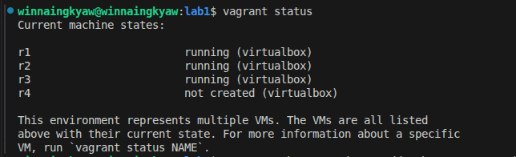
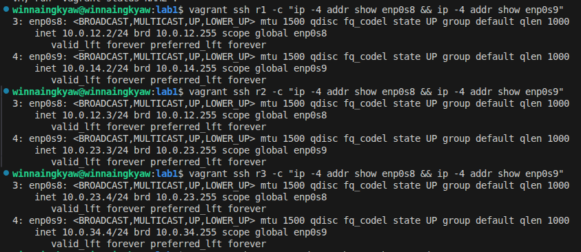
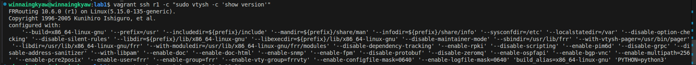
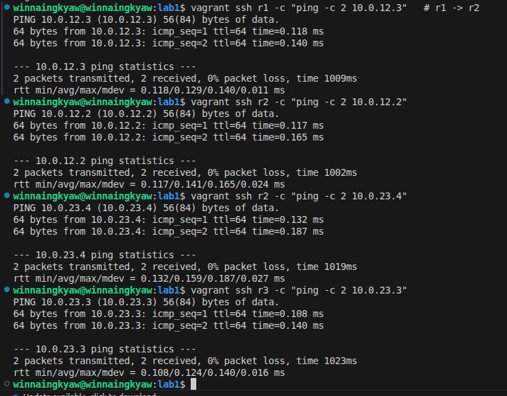
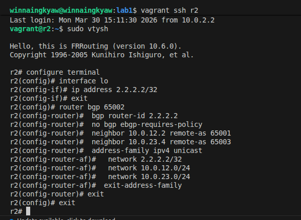
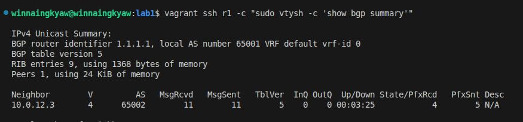
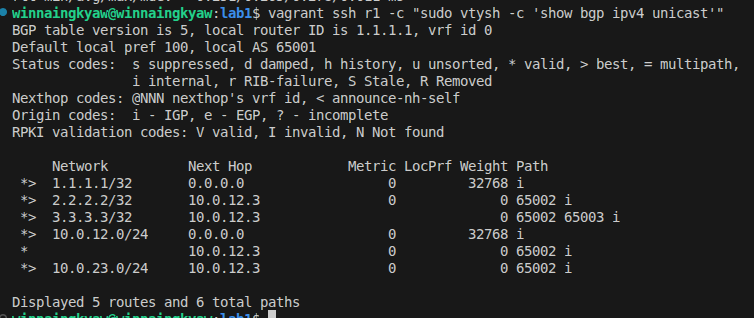
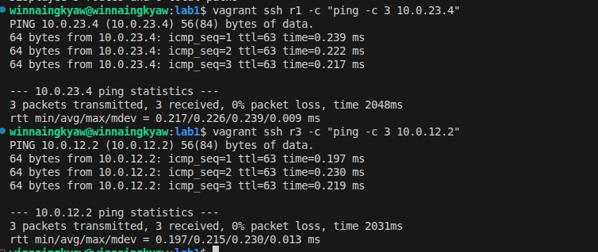

# RUNBOOK 1a — From Zero to eBGP String Topology

Reproduce the lab1a milestone from scratch: 3-router eBGP string (r1 -- r2 -- r3).

## Prerequisites

- VirtualBox installed
- Vagrant installed
- ~2GB free RAM (3 VMs x 512MB)
- Host machine running Linux

---

## Step 1: Boot the VMs

```bash
cd bgp-labs/lab1
vagrant up r1 && vagrant up r2 && vagrant up r3
```

Boot sequentially to avoid resource contention. Wait for provisioning to finish on each
(FRR is installed automatically via the Vagrantfile shell provisioner).

> **If a VM times out:** The `&&` chain will abort, leaving later VMs un-created.
> To recover, destroy all VMs and restart:
>
> ```bash
> vagrant destroy -f
> vagrant up r1 && vagrant up r2 && vagrant up r3
> ```
>
> If timeouts persist, boot one at a time with a pause between each:
>
> ```bash
> vagrant up r1 && sleep 10 && vagrant up r2 && sleep 10 && vagrant up r3
> ```

Verify all 3 are running:

```bash
vagrant status
```

Expected:

```
r1    running (virtualbox)
r2    running (virtualbox)
r3    running (virtualbox)
```

---

## Step 2: Verify interfaces

SSH into each router and confirm the private network interfaces have IPs:

```bash
vagrant ssh r1 -c "ip -4 addr show enp0s8 && ip -4 addr show enp0s9"
vagrant ssh r2 -c "ip -4 addr show enp0s8 && ip -4 addr show enp0s9"
vagrant ssh r3 -c "ip -4 addr show enp0s8 && ip -4 addr show enp0s9"
```

Expected IPs:

| Router | enp0s8 | enp0s9 |
|--------|--------|--------|
| r1 | 10.0.12.2/24 | 10.0.14.2/24 |
| r2 | 10.0.12.3/24 | 10.0.23.3/24 |
| r3 | 10.0.23.4/24 | 10.0.34.4/24 |


---

## Step 3: Verify FRR is running

```bash
vagrant ssh r1 -c "sudo vtysh -c 'show version'"
```

Expected: `FRRouting 10.6.0` (or similar). Repeat for r2, r3.


---

## Step 4: Verify direct neighbor connectivity

```bash
vagrant ssh r1 -c "ping -c 2 10.0.12.3"   # r1 -> r2
vagrant ssh r2 -c "ping -c 2 10.0.12.2"   # r2 -> r1
vagrant ssh r2 -c "ping -c 2 10.0.23.4"   # r2 -> r3
vagrant ssh r3 -c "ping -c 2 10.0.23.3"   # r3 -> r2
```

All should show 0% packet loss. If a ping fails, check `ip addr` — the interface may not have been configured by Vagrant.


---

## Step 5: Configure r1

```bash
vagrant ssh r1
sudo vtysh
```

```
configure terminal

interface lo
 ip address 1.1.1.1/32
exit

router bgp 65001
 bgp router-id 1.1.1.1
 no bgp ebgp-requires-policy
 neighbor 10.0.12.3 remote-as 65002
 neighbor 10.0.14.5 remote-as 65004
 !
 address-family ipv4 unicast
  network 1.1.1.1/32
  network 10.0.12.0/24
  network 10.0.14.0/24
 exit-address-family
exit
exit
```

What each command does:

| Command | Purpose |
|---------|---------|
| `interface lo` / `ip address 1.1.1.1/32` | Create a stable loopback for router-id |
| `router bgp 65001` | Start BGP process in AS 65001 |
| `bgp router-id 1.1.1.1` | Use loopback as router identity (survives link failures) |
| `no bgp ebgp-requires-policy` | Allow routes without route-maps (lab only) |
| `neighbor 10.0.12.3 remote-as 65002` | Peer with r2 via link IP |
| `neighbor 10.0.14.5 remote-as 65004` | Peer with r4 via link IP (will show Active until r4 is configured) |
| `network ...` | Advertise these prefixes to BGP neighbors |


---

## Step 6: Configure r2

```bash
vagrant ssh r2
sudo vtysh
```

```
configure terminal

interface lo
 ip address 2.2.2.2/32
exit

router bgp 65002
 bgp router-id 2.2.2.2
 no bgp ebgp-requires-policy
 neighbor 10.0.12.2 remote-as 65001
 neighbor 10.0.23.4 remote-as 65003
 !
 address-family ipv4 unicast
  network 2.2.2.2/32
  network 10.0.12.0/24
  network 10.0.23.0/24
 exit-address-family
exit
exit
```

---

## Step 7: Configure r3

```bash
vagrant ssh r3
sudo vtysh
```

```
configure terminal

interface lo
 ip address 3.3.3.3/32
exit

router bgp 65003
 bgp router-id 3.3.3.3
 no bgp ebgp-requires-policy
 neighbor 10.0.23.3 remote-as 65002
 !
 address-family ipv4 unicast
  network 3.3.3.3/32
  network 10.0.23.0/24
 exit-address-family
exit
exit
```

---

## Step 8: Verify BGP sessions

```bash
vagrant ssh r1 -c "sudo vtysh -c 'show bgp summary'"
vagrant ssh r2 -c "sudo vtysh -c 'show bgp summary'"
vagrant ssh r3 -c "sudo vtysh -c 'show bgp summary'"
```


Expected: all neighbors show an **Up/Down time** (not `Active` or `never`).

| Session | Expected State |
|---------|---------------|
| r1 ↔ r2 | Established |
| r2 ↔ r3 | Established |
| r1 → r4 | Active (r4 not configured yet — expected) |

---

## Step 9: Verify BGP routes on r1

```bash
vagrant ssh r1 -c "sudo vtysh -c 'show bgp ipv4 unicast'"
```

Expected BGP table:

```
     Network          Next Hop        Path
 *>  1.1.1.1/32       0.0.0.0         i              ← local (r1 loopback)
 *>  2.2.2.2/32       10.0.12.3       65002 i        ← learned from r2
 *>  3.3.3.3/32       10.0.12.3       65002 65003 i  ← learned from r3 via r2
 *>  10.0.12.0/24     0.0.0.0         i              ← local (r1-r2 link)
 *>  10.0.14.0/24     0.0.0.0         i              ← local (r1-r4 link)
 *>  10.0.23.0/24     10.0.12.3       65002 i        ← learned from r2
```

Key: the AS path `65002 65003` on `3.3.3.3/32` means: originated in AS65003, transited AS65002, arrived at r1.


---

## Step 10: The milestone test — r1 pings r3

```bash
vagrant ssh r1 -c "ping -c 3 10.0.23.4"
vagrant ssh r3 -c "ping -c 3 10.0.12.2"
```

Expected:

```
64 bytes from 10.0.23.4: icmp_seq=1 ttl=63 time=0.218 ms
```

- **TTL=63** confirms 1 hop through r2 (default 64, minus 1 per hop)
- **Both directions work** — r3 learned the return route to r1 via r2

---

## Troubleshooting

### BGP session stuck on `Active`

1. Check the neighbor IP is correct: `show running-config` on both sides
2. Check link connectivity: `ping <neighbor-link-ip>`
3. Check AS numbers match: r1 says `neighbor X remote-as 65002`, r2 must have `router bgp 65002`

### `PfxRcd = 0` (session up but no routes)

1. Check `network` statements exist under `address-family ipv4 unicast`
2. Check `no bgp ebgp-requires-policy` is set on both sides
3. The advertised network must exist in the routing table (connected or static)

### Ping fails between non-neighbors

1. Check `show ip route` — is there a B (BGP) route for the destination?
2. If no BGP route: the remote router is not advertising that network
3. If BGP route exists but ping fails: check return path — remote router needs a route back

---

## Quick Reference

| Router | AS | Loopback | Link to r1 | Link to r2 | Link to r3 | Link to r4 |
|--------|----|----------|------------|------------|------------|------------|
| r1 | 65001 | 1.1.1.1 | — | 10.0.12.2 | — | 10.0.14.2 |
| r2 | 65002 | 2.2.2.2 | 10.0.12.3 | — | 10.0.23.3 | — |
| r3 | 65003 | 3.3.3.3 | — | 10.0.23.4 | — | 10.0.34.4 |
| r4 | 65004 | 4.4.4.4 | 10.0.14.5 | — | 10.0.34.5 | — |
