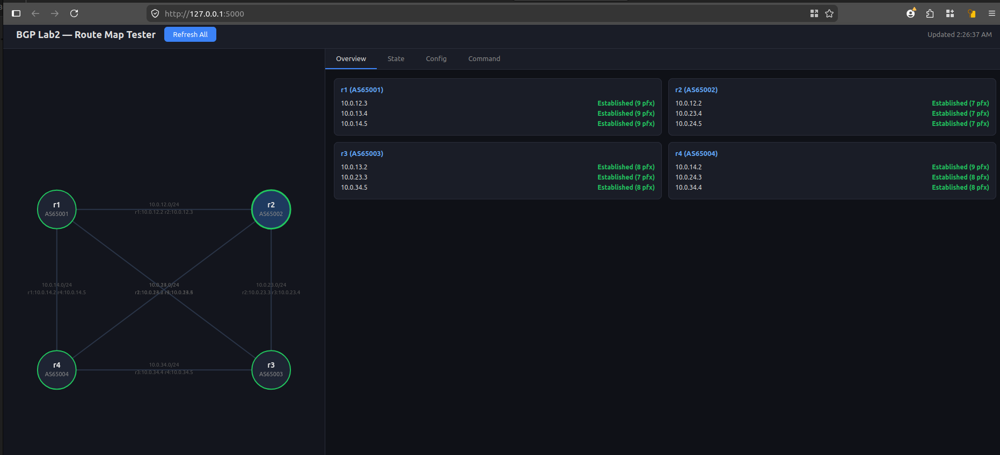
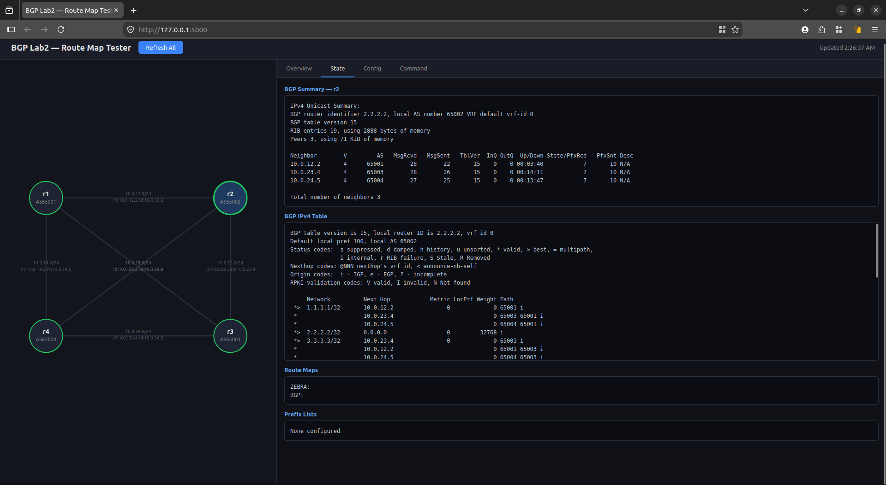
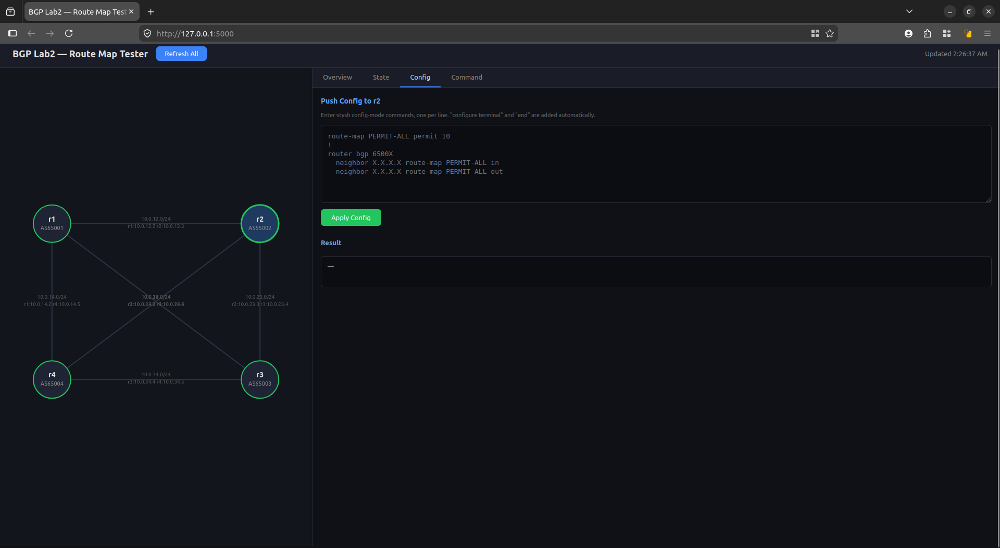
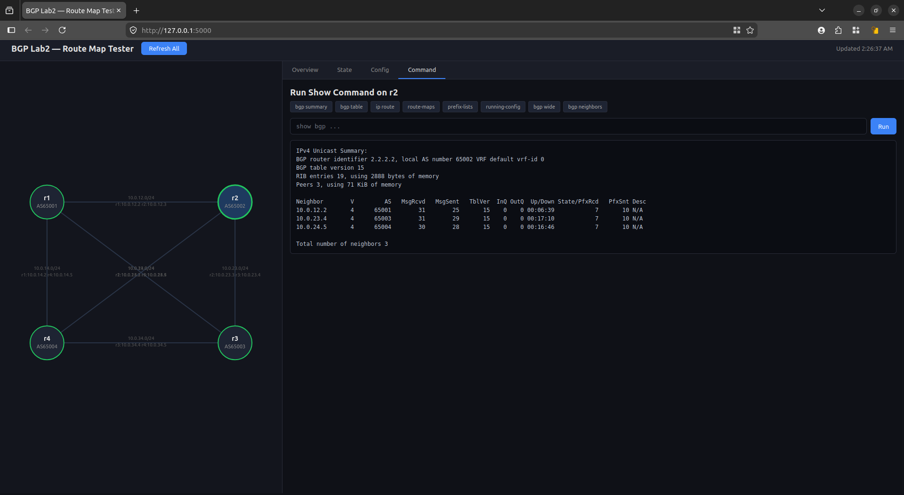

# RUNBOOK 2a — Full Mesh Baseline

Date: 2026-04-02

## Goal

Get all 4 routers peering in a full mesh eBGP setup using `no bgp ebgp-requires-policy`.
This is the "get it working first" step before adding proper route-maps later.

## Topology

```
r1 (AS65001) ----10.0.12.0/24---- r2 (AS65002)
   |  \                          /    |
   |   10.0.13.0/24    10.0.24.0/24   |
   |        \          /              |
10.0.14.0/24  \      /         10.0.23.0/24
   |            \  /                  |
r4 (AS65004) ----10.0.34.0/24---- r3 (AS65003)
```

6 links, 4 routers, each in its own AS.

## Steps

### 1. Boot the VMs

```bash
cd lab2
vagrant up
```

### 2. Configure each router

SSH in with `vagrant ssh rX`, then `sudo vtysh`.

#### r1 (AS 65001)

```
configure terminal
interface lo
 ip address 1.1.1.1/32
exit
router bgp 65001
 bgp router-id 1.1.1.1
 no bgp ebgp-requires-policy
 neighbor 10.0.12.3 remote-as 65002
 neighbor 10.0.13.4 remote-as 65003
 neighbor 10.0.14.5 remote-as 65004
 address-family ipv4 unicast
  network 1.1.1.1/32
  network 10.0.12.0/24
  network 10.0.13.0/24
  network 10.0.14.0/24
 exit-address-family
exit
exit
```

#### r2 (AS 65002)

```
configure terminal
interface lo
 ip address 2.2.2.2/32
exit
router bgp 65002
 bgp router-id 2.2.2.2
 no bgp ebgp-requires-policy
 neighbor 10.0.12.2 remote-as 65001
 neighbor 10.0.23.4 remote-as 65003
 neighbor 10.0.24.5 remote-as 65004
 address-family ipv4 unicast
  network 2.2.2.2/32
  network 10.0.12.0/24
  network 10.0.23.0/24
  network 10.0.24.0/24
 exit-address-family
exit
exit
```

#### r3 (AS 65003)

```
configure terminal
interface lo
 ip address 3.3.3.3/32
exit
router bgp 65003
 bgp router-id 3.3.3.3
 no bgp ebgp-requires-policy
 neighbor 10.0.13.2 remote-as 65001
 neighbor 10.0.23.3 remote-as 65002
 neighbor 10.0.34.5 remote-as 65004
 address-family ipv4 unicast
  network 3.3.3.3/32
  network 10.0.13.0/24
  network 10.0.23.0/24
  network 10.0.34.0/24
 exit-address-family
exit
exit
```

#### r4 (AS 65004)

```
configure terminal
interface lo
 ip address 4.4.4.4/32
exit
router bgp 65004
 bgp router-id 4.4.4.4
 no bgp ebgp-requires-policy
 neighbor 10.0.14.2 remote-as 65001
 neighbor 10.0.24.3 remote-as 65002
 neighbor 10.0.34.4 remote-as 65003
 address-family ipv4 unicast
  network 4.4.4.4/32
  network 10.0.14.0/24
  network 10.0.24.0/24
  network 10.0.34.0/24
 exit-address-family
exit
exit
```

### 3. Verify

On each router:

```
show bgp summary
```

All 3 neighbors should show `Established` with PfxRcd > 0.

```
show bgp ipv4 unicast
```

Should see all 10 prefixes (4 loopbacks + 6 link subnets).

### 4. Ping test

From r1:
```
ping 2.2.2.2 source 1.1.1.1
ping 3.3.3.3 source 1.1.1.1
ping 4.4.4.4 source 1.1.1.1
```

### 5. Web UI

Built a small Flask app to visualize the topology and interact with routers live.

```bash
cd lab2
pip install -r web/requirements.txt
python web/app.py
```

Open http://localhost:5000 — click routers to inspect BGP state, push config, run show commands.

Screenshots:






## What I learned

- `no bgp ebgp-requires-policy` is a shortcut that skips route-map requirements. It works but it's not how you'd run a real network.
- Full mesh means every router has a direct path to every other router — more paths in the BGP table compared to Lab 1's ring.
- `address-family ipv4 unicast` with `network` statements is how you tell BGP what to advertise. The prefix must exist in the routing table (connected or loopback) for BGP to actually announce it.

## Next up

Lab 2b — replace `no bgp ebgp-requires-policy` with proper route-maps and start filtering with prefix-lists.
